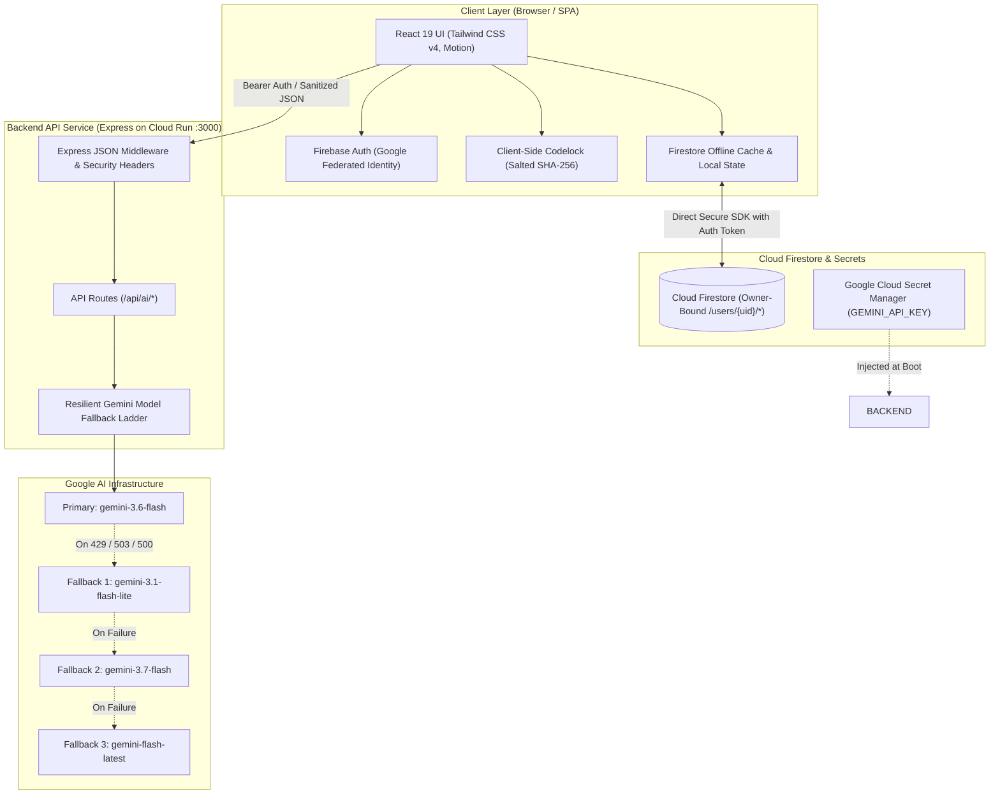
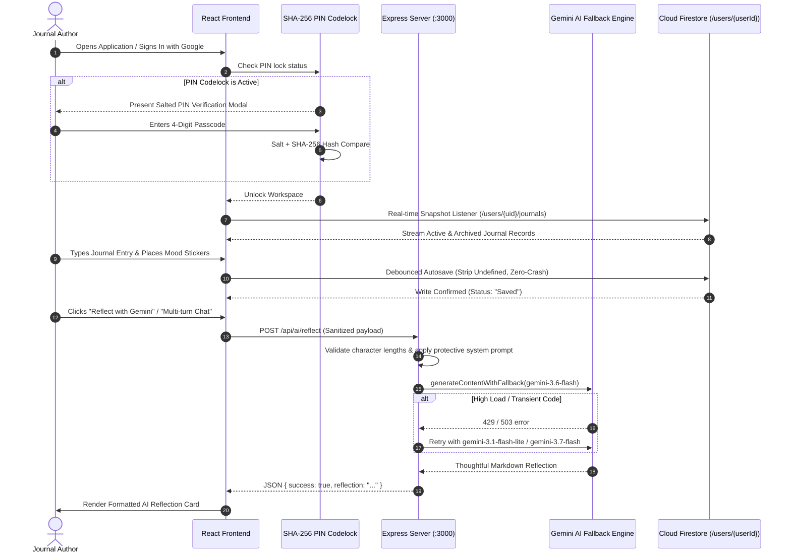

# Gemini Journal 🌸

> **A Production-Grade, Confidentially Isolated AI Journaling Application**  
> Built with React 19, TypeScript, Tailwind CSS v4, Express, Firebase Firestore, and Google Gen AI SDK (`@google/genai`).

---

## 📑 Table of Contents
1. [Architecture & System Flow Diagrams](#-architecture--system-flow-diagrams)
2. [Complete Repository & Project Structure Guide](#-complete-repository--project-structure-guide)
3. [Threat Modeling & Security Architecture](#-threat-modeling--security-architecture)
4. [Local Development & Testing Guide](#-local-development--testing-guide)
5. [Firestore Security Rules](#-firestore-security-rules)
6. [Production Deployment to Google Cloud Run](#-production-deployment-to-google-cloud-run)
7. [Comprehensive Verification & Test Walkthrough](#-comprehensive-verification--test-walkthrough)

---

## 🏛️ Architecture & System Flow Diagrams

Gemini Journal is engineered with a **defense-in-depth security model**. All AI interactions are proxied through a hardened server-side Express layer, keeping the `GEMINI_API_KEY` hidden from the client browser. Database access is strictly owner-bound at the Firestore security rule boundary (`/users/{userId}/*`).

### 1. High-Level System Architecture Diagram



---

### 2. End-to-End User Interaction & Data Flow



---

## 📂 Complete Repository & Project Structure Guide

```
├── .env.example                # Sample environment variable declarations
├── Dockerfile                  # Container build instructions for Cloud Run
├── README.md                   # Complete architectural & operational guide
├── firestore.rules             # Production Firestore owner-isolation rules
├── index.html                  # HTML5 entrypoint with Google Fonts & viewport
├── metadata.json               # AI Studio project configuration & permissions
├── package.json                # Project dependencies, build scripts, engine configs
├── server.ts                   # Production Express backend + Gemini AI proxy + Vite dev middleware
├── tsconfig.json               # TypeScript compiler options
├── vite.config.ts              # Vite configuration with Tailwind CSS v4 plugin
└── src/
    ├── App.tsx                 # Root layout container, tab router, auto-lock controller
    ├── main.tsx                # React DOM root bootstrapping
    ├── index.css               # Global Tailwind CSS directives & typography rules
    ├── types.ts                # Master TypeScript interface definitions
    ├── components/             # Reusable UI modules & functional panels
    │   ├── AiAssistantPanel.tsx        # Multi-turn Gemini chat, reflections, summaries & prompts
    │   ├── CodelockModal.tsx           # Salted SHA-256 biometric/PIN lock screen
    │   ├── EmojiPickerPopover.tsx      # Mood emoji selector popover
    │   ├── Header.tsx                  # Top navigation bar, auth state, quick controls
    │   ├── InsightsDashboard.tsx       # 14-day writing rhythm, streaks, mood & sticker metrics
    │   ├── JournalEditor.tsx           # Distraction-free rich editor, canvas sticker layer, autosave
    │   ├── JournalHistory.tsx          # Memory archive, filtering, search, favorite tagging, export
    │   ├── LandingPage.tsx             # Welcome screen with feature showcases & Google Sign-in
    │   ├── PrivacySecurityCenter.tsx   # PIN config, GDPR data export & zero-trust purge
    │   ├── ReminderModal.tsx           # Daily mindful journaling reminder schedule modal
    │   ├── StickerStudio.tsx           # Drag-and-drop sticker creator, emoji catalog & library
    │   ├── TemplatePickerModal.tsx     # Curated daily reflection & mindfulness templates
    │   └── ThemeStudio.tsx             # 12 presets, 4 seasonal dynamic themes, RGB custom creator
    ├── data/                   # Default datasets and static configurations
    │   ├── palettes.ts         # 12 curated palettes + 4 seasonal palette definitions
    │   ├── stickers.ts         # 15+ starter mindful aesthetic sticker packs
    │   └── templates.ts        # Morning gratitude, evening reflection, CBT & stoic templates
    └── lib/                    # Core utilities, crypto engines, & context providers
        ├── aiClient.ts         # Frontend API caller utilities proxying server endpoints
        ├── authContext.tsx     # Firebase Authentication state listener & provider
        ├── crypto.ts           # Client-side cryptographic salt & SHA-256 hash engine
        ├── firebase.ts         # Firebase App & Firestore client initialization
        ├── storage.ts          # Firestore CRUD service with zero-crash undefined strippers
        └── themeContext.tsx    # Dynamic seasonal theme & custom palette state manager
```

---

## 🔒 Threat Modeling & Security Architecture

| Threat Zone | Specific Threat Vector | Architectural Countermeasure |
| :--- | :--- | :--- |
| **Input Surfaces** | Prompt injection via untrusted journal text or user chat payloads. | Explicit delimiter isolation (`"""`), prompt sandboxing, strict character length boundaries (max 25,000 for entries, 4,000 for chat). |
| **Planning & Reasoning** | System instruction bypass, jailbreaks, or tool hijacking. | Immutable server-side system prompts enforcing supportive, empathetic, and confidential persona boundaries. |
| **Tool & Secret Execution** | Gemini API key theft or SSRF leakage. | Zero client-side API keys. Keys are injected via Google Secret Manager directly into the backend `server.ts` runtime. |
| **Memory & State** | Cross-user data leakage, IDOR, or tampering. | Owner-bound Firestore security rules (`request.auth.uid == userId`) prohibiting unauthorized access. |
| **Inter-System Comms** | Upstream Gemini API rate-limiting (429) or transient outage (503). | Resilient 4-tier model fallback ladder (`gemini-3.6-flash` ➔ `gemini-3.1-flash-lite` ➔ `gemini-3.7-flash` ➔ `gemini-flash-latest`). |

---

## 💻 Local Development & Testing Guide

Follow these step-by-step instructions to run and test Gemini Journal on your local machine.

### 1. Prerequisites
- **Node.js**: Version 18.0.0 or higher (`node -v`)
- **npm**: Version 9.0.0 or higher (`npm -v`)
- **Gemini API Key**: Obtainable for free at [Google AI Studio](https://aistudio.google.com/)
- **Firebase Project**: A Firebase project with Google Authentication & Cloud Firestore enabled.

---

### 2. Clone & Install Dependencies

```bash
# Clone your repository
git clone https://github.com/your-username/gemini-journal.git
cd gemini-journal

# Install dependencies
npm install
```

---

### 3. Configure Local Environment Variables

Create a `.env` file in the root directory:

```bash
cp .env.example .env
```

Populate the `.env` file with your credentials:

```env
# Server-side Gemini Secret (Never prefix with VITE_)
GEMINI_API_KEY=your_actual_gemini_api_key_here

# Client-side Firebase Configuration (Provided by Firebase Console)
VITE_FIREBASE_API_KEY=AIzaSy...
VITE_FIREBASE_AUTH_DOMAIN=your-app.firebaseapp.com
VITE_FIREBASE_PROJECT_ID=your-project-id
VITE_FIREBASE_STORAGE_BUCKET=your-app.appspot.com
VITE_FIREBASE_MESSAGING_SENDER_ID=1234567890
VITE_FIREBASE_APP_ID=1:1234567890:web:abcdef
```

---

### 4. Start the Full-Stack Dev Server

```bash
npm run dev
```

The unified development server (Express + Vite middleware) will start at:
👉 **`http://localhost:3000`**

---

### 5. Running Automated Quality & Build Checks

```bash
# 1. Typecheck and lint without emitting code
npm run lint

# 2. Test production build bundle
npm run build

# 3. Test production start execution
npm run start
```

---

### 6. Testing Backend API Endpoints via cURL

Open a second terminal window to verify backend API health and AI proxy routes:

```bash
# 1. Health Check
curl -X GET http://localhost:3000/api/health

# 2. Test AI Reflection Proxy
curl -X POST http://localhost:3000/api/ai/reflect \
  -H "Content-Type: application/json" \
  -d '{
    "title": "Morning Walk",
    "content": "Today I took a quiet walk in the park. The morning air was crisp and I felt a deep sense of calm and clarity.",
    "mood": "🌿 Peaceful"
  }'

# 3. Test AI Summarization
curl -X POST http://localhost:3000/api/ai/summarize \
  -H "Content-Type: application/json" \
  -d '{
    "title": "Productive Thursday",
    "content": "Finished all quarterly goals, spent 2 hours learning TypeScript generics, and drank 3 liters of water."
  }'

# 4. Test Multi-Turn Chat
curl -X POST http://localhost:3000/api/ai/chat \
  -H "Content-Type: application/json" \
  -d '{
    "message": "What should I focus on tomorrow based on my entry?",
    "journalTitle": "Productive Thursday",
    "journalContent": "Finished quarterly goals.",
    "history": []
  }'
```

---

## 🛡️ Firestore Security Rules

Deploy these rules to your Firebase Firestore project via the Firebase Console or Firebase CLI (`firebase deploy --only firestore:rules`):

```javascript
rules_version = '2';
service cloud.firestore {
  match /databases/{database}/documents {
    // Isolated User namespace: users can only read/write their own document tree
    match /users/{userId} {
      allow read, write: if request.auth != null && request.auth.uid == userId;

      match /journals/{journalId} {
        allow read, write: if request.auth != null && request.auth.uid == userId;
        
        match /messages/{messageId} {
          allow read, write: if request.auth != null && request.auth.uid == userId;
        }
      }

      match /summaries/{summaryId} {
        allow read, write: if request.auth != null && request.auth.uid == userId;
      }

      match /settings/{settingId} {
        allow read, write: if request.auth != null && request.auth.uid == userId;
      }

      match /backups/{backupId} {
        allow read, write: if request.auth != null && request.auth.uid == userId;
      }

      match /stickers/{stickerId} {
        allow read, write: if request.auth != null && request.auth.uid == userId;
      }

      match /interactions/{interactionId} {
        allow read, write: if request.auth != null && request.auth.uid == userId;
      }
    }
  }
}
```

---

## 🚀 Production Deployment to Google Cloud Run

### 1. Prerequisites & Enable GCP APIs
Ensure you are logged into your Google Cloud project via the `gcloud` CLI:

```bash
# Authenticate
gcloud auth login
gcloud config set project YOUR_PROJECT_ID

# Enable Required APIs
gcloud services enable \
  run.googleapis.com \
  secretmanager.googleapis.com \
  firestore.googleapis.com \
  cloudbuild.googleapis.com
```

---

### 2. Configure Secret Manager for Gemini API Key

```bash
# Create the secret in Secret Manager
gcloud secrets create GEMINI_API_KEY --replication-policy="automatic"

# Inject your key value
echo -n "YOUR_ACTUAL_GEMINI_API_KEY" | gcloud secrets versions add GEMINI_API_KEY --data-file=-

# Grant Cloud Run default compute service account permission to read the secret
PROJECT_NUMBER=$(gcloud projects describe $(gcloud config get-value project) --format="value(projectNumber)")

gcloud secrets add-iam-policy-binding GEMINI_API_KEY \
  --member="serviceAccount:${PROJECT_NUMBER}-compute@developer.gserviceaccount.com" \
  --role="roles/secretmanager.secretAccessor"
```

---

### 3. Deploy Service to Cloud Run

```bash
gcloud run deploy gemini-journal \
  --source . \
  --platform managed \
  --region us-central1 \
  --allow-unauthenticated \
  --port 3000 \
  --set-secrets="GEMINI_API_KEY=GEMINI_API_KEY:latest"
```

---

### 4. Mandatory Campaign Labeling & Verification

Apply the required resource label to register the service for automated challenge verification:

```bash
gcloud run services update gemini-journal \
  --update-labels=dev-tutorial=cloud-run-ai-challenge \
  --region=us-central1
```

---

## 🧪 Comprehensive Verification & Test Walkthrough

Walk through these verification cases to validate all user-facing and backend functionality:

| Test ID | Area / Flow | Action to Perform | Expected Result |
| :--- | :--- | :--- | :--- |
| **TC-01** | **Authentication** | Click **"Sign In with Google"** on the landing view. | Google popup opens; upon authorization, user session initializes and personal journals load instantly. |
| **TC-02** | **Journal Writing & Autosave** | Type title, body paragraphs, and pick a mood emoji. | Real-time status indicator transitions from *"Saving..."* to *"Saved"* with zero UI freeze. |
| **TC-03** | **Canvas Stickers** | Click **Stickers**, choose an emoji sticker, drag it across the page, click rotate (`↻`). | Sticker floats on canvas, follows drag coordinates, and persists in both the entry and sticker tray. |
| **TC-04** | **AI Reflection** | In the right-hand panel, click **"Reflect with Gemini"**. | Express backend calls Gemini; displays an empathetic Markdown card with thoughtful questions. |
| **TC-05** | **Multi-Turn AI Chat** | In the AI Companion tab, send a question about your journal. | Gemini answers in context of your current journal entry and persists the message history. |
| **TC-06** | **AI Summarization** | In the AI Companion tab, click **"Generate Structured Summary"**. | Generates a 4-part summary (Summary, Key Takeaways, Action Items, Reflection Question). |
| **TC-07** | **Seasonal Dynamic Themes** | In **Themes**, check **"Auto-apply current season"** or click a season. | App aesthetic immediately transitions to match current season (Spring 🌸, Summer ☀️, Autumn 🍂, Winter ❄️). |
| **TC-08** | **Codelock PIN Security** | Go to **Security Center**, enable PIN lock, enter `1234`. Click **"Lock Now"**. | App blurs and locks behind the SHA-256 PIN screen. Entering `1234` unlocks; wrong PIN shows error. |
| **TC-09** | **14-Day Rhythm & Insights** | Navigate to the **Insights** tab. | Current weekday (e.g. Thursday) shows exact entry count with "Today" badge, streaks, and top stickers. |
| **TC-10** | **JSON Backup Export** | In **Security Center**, click **"Export All Entries (JSON)"**. | Downloads a complete, structured JSON backup file of all user entries, timestamps, tags, and stickers. |
| **TC-11** | **Zero-Trust Data Purge** | In **Security Center**, click **"Permanently Purge All Data"**. | Confirms dialog and securely deletes all documents under `/users/{userId}` in Cloud Firestore. |

---

## 📄 License & Compliance

Licensed under the **MIT License**. Compliant with **OWASP Top 10 Web** & **OWASP Top 10 LLM Applications** security guidelines.
